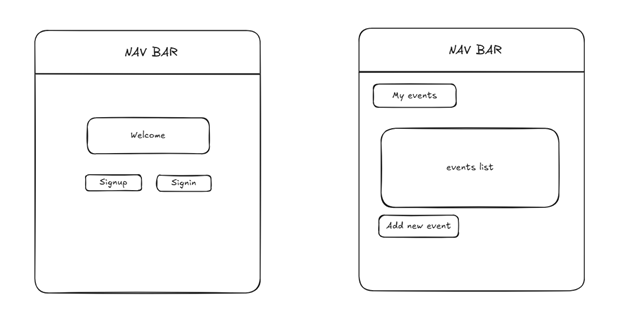
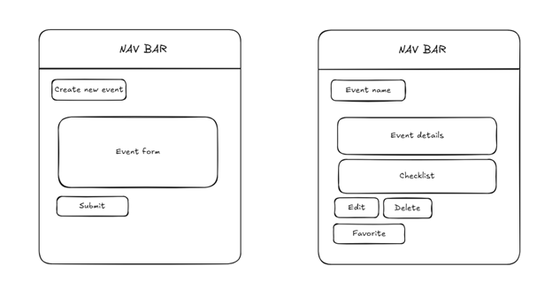

# Welcome to PlanPop — Your Personal Event Planning Hub
PlanPop makes organizing events simple, stylish, and stress-free. Whether you're hosting a birthday, study session, team meetup, or weekend hangout, PlanPop helps you create, track, and share your plans with ease. Build your own event dashboard, manage tasks with interactive checklists, and explore public events for inspiration. Sign up today and start planning with purpose!

## Table of Contents
- [Features](#features)
- [Getting Started](#getting-started)
- [Attributions](#attributions)
- [Technologies Used](#technologies-used)
- [Next Steps](#next-steps)
- [Planning](#planning)
- [License](#license)

## Features
- User registration and login with session management
- Basic CRUD operations
- Modular file structure
- Example routes and controllers
- Basic user model setup
- Middleware for templates and authorization
- Basic authentication flow

## Getting Started
Unable to deploy project due to technical issues. Plan linked in Table of Contents.

## Attributions
Dynamic Checklist: 
- <a>https://developer.mozilla.org/en-US/docs/Web/API/EventTarget/addEventListener <a>
- <a>https://stackoverflow.com/questions/46188335/how-to-add-event-listener-to-a-dynamically-created-checkbox-and-check-if-checkbo</a>

## Technologies Used
- JavaScript
- EJS/Express
- CSS

## Next Steps
- Improve the "Other Users" page by including profile pictures.
- Visually show task completion with a progress bar or an animated percentage. 
- Introduce dark mode.
- Have ready made checklist templates for common events.
- Have event reminders.

## Planning 
  <strong> User Stories </strong>
  - As a User (AAU), I want to sign up for an account and sign in, so that I can access my event dashboard and manage my plans.
  - AAU, I want an easy and consistent way to navigate through the site, whether I am signed in or not. I need to quickly access options to sign up, sign in, view my events, or sign out, depending on my current status.
  - AAU, I need a dedicated page to view all events I’ve created, to easily manage and review my upcoming plans.
  - AAU, I want to easily find and click on an ‘Add New Event’ link, which takes me to a form for creating a new event with details like title, date, location, and description.
  - AAU, after filling out the event form, I want to submit it and receive confirmation that the event has been saved to my dashboard.
  - AAU, I need the ability to edit and delete events I’ve created, allowing me full control over managing my schedule.
  - AAU, I want to add checklist items to each event, so I can track tasks and preparation steps.
  - AAU, I want to mark checklist items as complete, so I can monitor my progress and stay organized.
  - AAU, I am interested in viewing a list of all other app users, to foster a sense of community and exchange planning ideas.
  - AAU, I want the option to click on another user’s profile and view all of their public events and checklists, to get inspiration for my own planning.

  <strong>Routes</strong> 
   
    /users/:userId/events	GET (index) 
    /users/:userId/events/new	GET (new) 
    /users/:userId/events	POST (create) 
    /users/:userId/events/:eventId	GET (show) 
    /users/:userId/events/:eventId/edit	GET (edit) 
    /users/:userId/events/:eventId	PUT (update) 
    /users/:userId/events/:eventId	DEL (delete) 

<strong>Wire Frames</strong> 
 
 
 

<strong> Entity Relationship Diagram </strong> 
 

## License
This project is licensed under the MIT License. See the LICENSE file for details.

